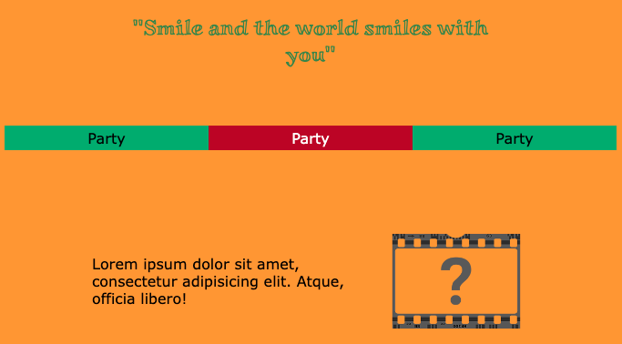
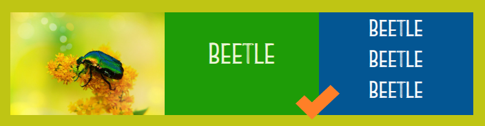

## Add your content

In this step you will fill in your layout with content to create the mood that you want. 

{:width="300px"}

--- task ---

{:width="300px"}

Add any **text** that you want to appear on your mood board.

**Choose:** Your text could be any combination of:
+ short words or phrases that fit with your topic
+ nonsense 'lorem ipsum' placeholder text to give the idea of what text would look like
+ an inspirational quote

Don't spend too much time on the detail of the text. A mood board just sets the mood for a project.

[[[add-placeholder-text]]]

[[[full-width-quote]]]

--- /task ---

--- task ---

**Choose:** Add images and/or emoji to make your page more interesting.

The starter project includes lots of images that you could use on your mood board.

[[[trinket-image-library]]]

[[[huge-emoji]]]

There are lots of different emoji to choose from:

[[[choose-an-emoji]]]

**Tip:** It's fine to use the same image or emoji multiple times on your page to quickly fill your page.

--- /task ---

--- task ---

**Debug:**

--- collapse ---
---
title: My content has different heights and it looks odd
---

When you add content that has different heights, the boxes around them will be different heights.

You can change this by adding in the `tile` class:

--- code ---
---
language: HTML filename: index.html line_numbers: false

---

 --- /code ---

`tile` sets a specific height for each of the elements that have this class. You can adjust the height by changing it in the `style.css` file.

--- code ---
---
language: CSS filename: style.css line_numbers: false

---
.tile { height: 9.4rem; } --- /code ---

Adding the `tile` class will make every element with that class the same height:

--- /collapse ---

--- /task ---

--- task ---

**Test:** Have a look at your web page and make sure you are happy with the content.

[[[image-not-displayed]]]

[[[web-debug-link]]]

--- /task ---
