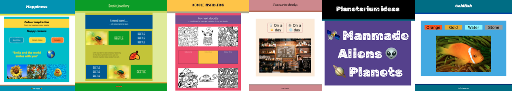
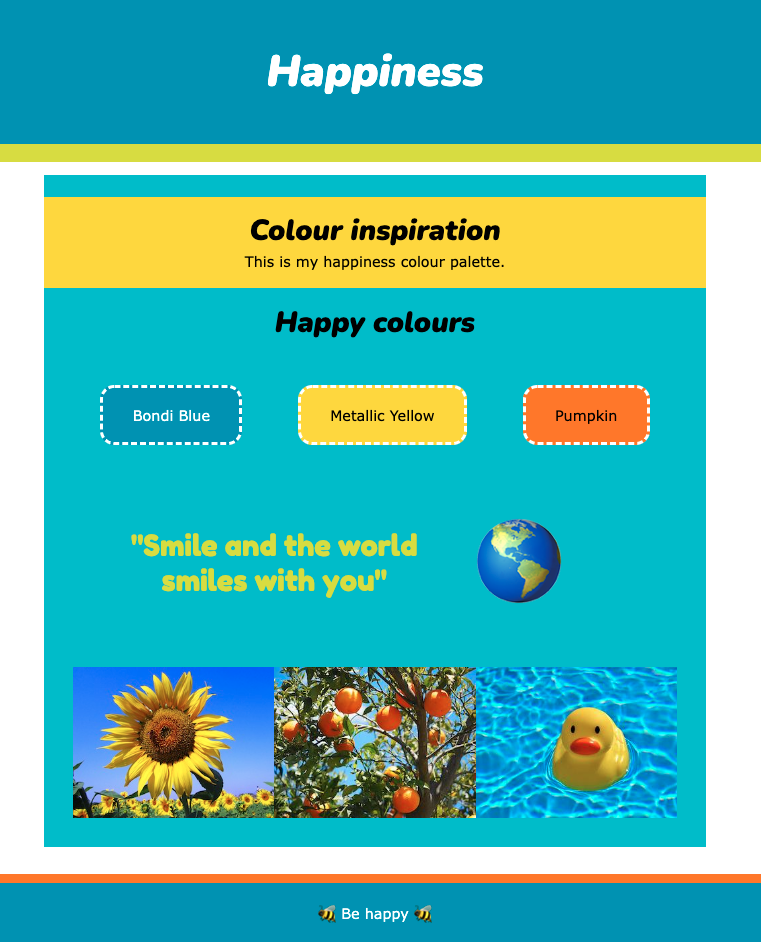
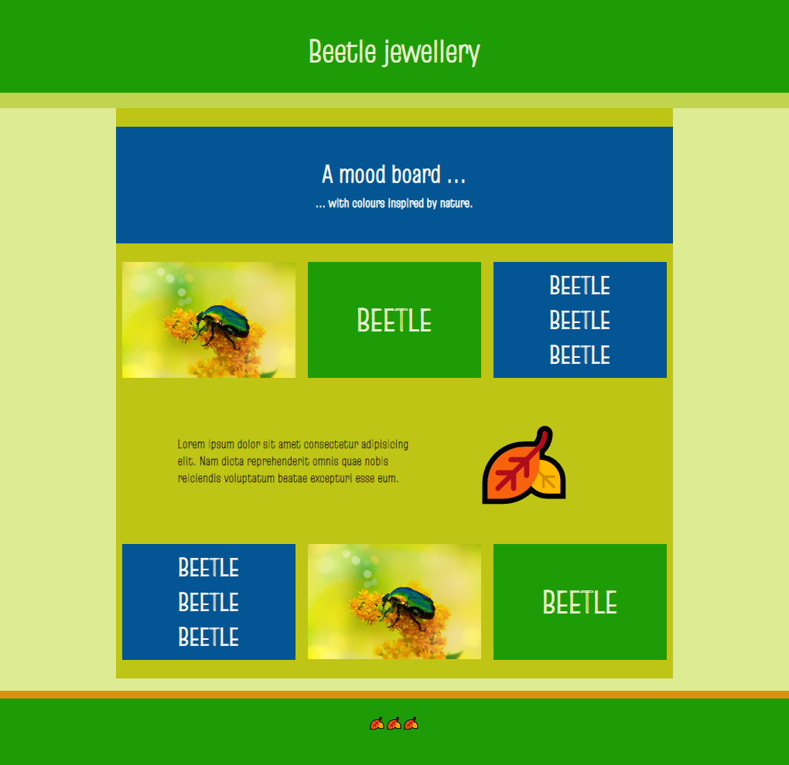
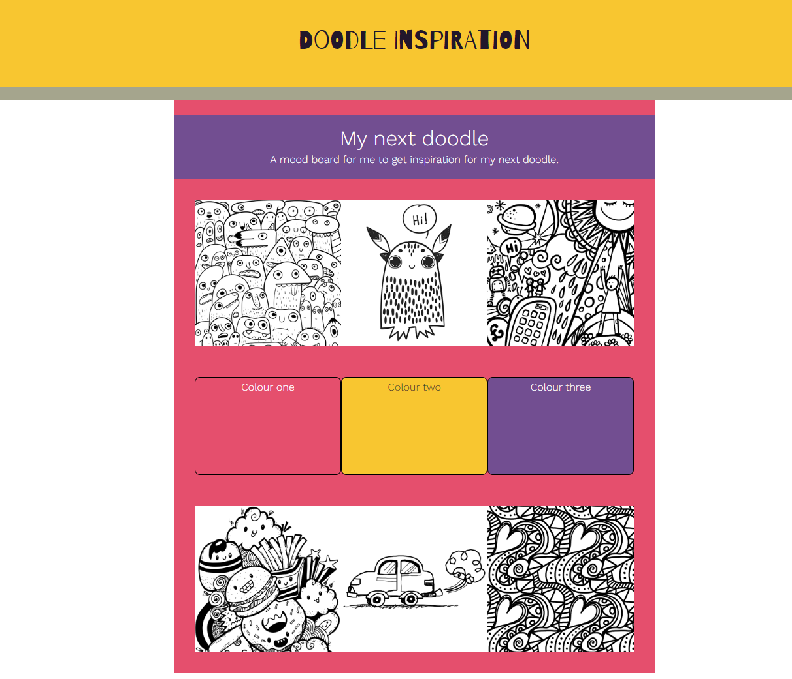

## Introduction

In this project you will create a mood board web page for a real or imaginary project. It could be a redesign of your bedroom, a fashion item, a party, a website, or as a reminder of all the things that make you happy.

A **mood board** is a collage that arranges images, fonts, colours, and other design elements to create a look or style for a project. Mood boards can be used for creating brand designs, product designs, and pretty much any other type of design project.

You will:
+ Have multiple sections with different layouts.
+ Use different colours and fonts that work well together.
+ Use images, emoji or both. 

--- no-print ---

--- task --- 

### Try it

  
A way to feel happier is to remember what is important to you. You could make a list of things that make you happy then create a mood board to display them together.

**Happiness**: [See inside](https://trinket.io/html/42802541b7){:target="_blank"}

<iframe src="https://trinket.io/embed/html/42802541b7?outputOnly=true" width="600" height="500" frameborder="0" marginwidth="0" marginheight="0" allowfullscreen></iframe>

--- /task ---

### Get inspiration 

You are going to make some design decisions to create your mood board.

--- task ---

Explore these example projects to get more ideas:

**Beetle**: [See inside](https://trinket.io/html/73702c6b80){:target="_blank"}

<iframe src="https://trinket.io/embed/html/73702c6b80?outputOnly=true" width="600" height="500" frameborder="0" marginwidth="0" marginheight="0" allowfullscreen></iframe>

**Colours of India**: [See inside](https://trinket.io/html/4fbecc95e7){:target="_blank"}

<iframe src="https://trinket.io/embed/html/4fbecc95e7?outputOnly=true" width="600" height="500" frameborder="0" marginwidth="0" marginheight="0" allowfullscreen></iframe>

**Doodles**: [See inside](https://trinket.io/html/8dd1f6474e){:target="_blank"}

<iframe src="https://trinket.io/embed/html/8dd1f6474e?outputOnly=true" width="600" height="500" frameborder="0" marginwidth="0" marginheight="0" allowfullscreen></iframe>

--- /task ---
--- /no-print ---

--- print-only ---

### Get inspiration 

**Happiness**

**Colours of India**

**Beetle**

**Doodles**

--- /print-only ---

