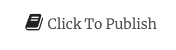
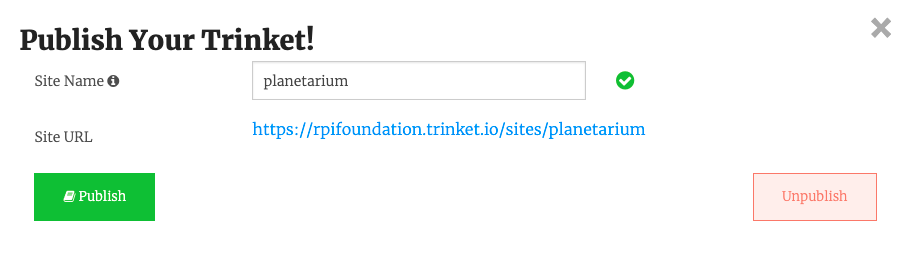
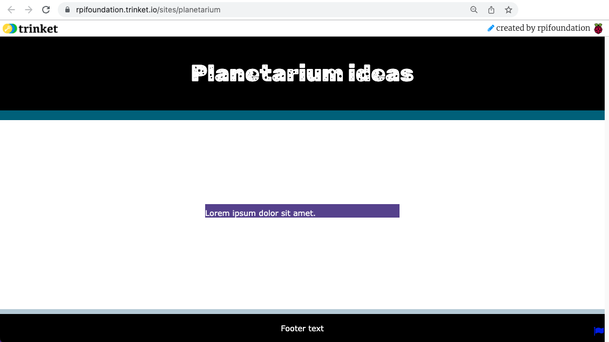
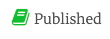
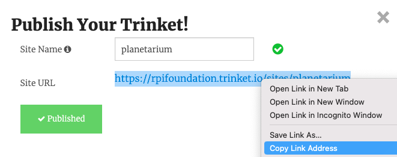
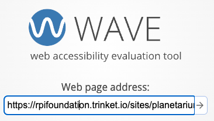
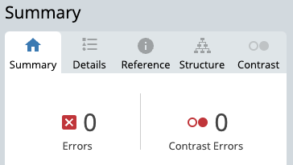
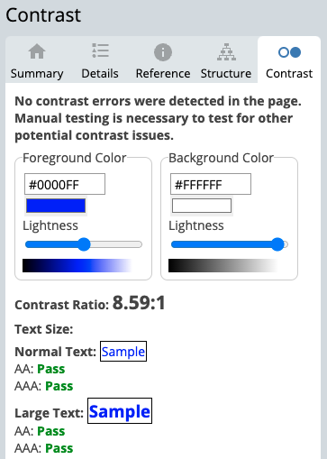

## Design your mood board

In this step you will choose a topic for your mood board and choose a matching colour palette and fonts. You will check that your colour palette has good contrast so that it is accessible. 

Image, gif or video showing what they will achieve by the end of the step. {:width="300px"}

--- task ---

What is the topic of your mood board? 

+ Party: for a specific occasion or theme
+ Artwork: Book cover, poster, flyer, comic book
+ Logo or product design 
+ Decorate a space: Classroom, makerspace, cafe
+ Fashion design: glasses frames, sari, bag
+ Inspired by nature: Terrarium, outside space
+ Inspired by animals: Fish tank, tropical rainforest 
+ Character design or world building

Remember, you don't need to create a complete web page, you are just going to make a page that is visually appealing and sets a mood.

--- /task ---

--- task ---

Change the `<h1>` title of your mood board to match your topic, for example 'Summer party'.

--- /task ---

**Graphic designers, interior designers, industrial designers, photographers, user interface designers and other creative artists** use mood boards to visually illustrate the style they wish to pursue. Amateur and professional designers alike may use them as an aid for more subjective purposes such as how they want to decorate their bedroom, or the vibe they want to convey through their fashion.

--- task ---

Open the [mood board starter project](https://trinket.io/library/trinkets/bb2ee12497){:target="_blank"}. 

--- /task ---

--- task ---

**Choose:** Set the colour palette for your mood board. You will need 5 colours `primary`, `secondary`, `tertiary`, `detail` and `detail2`.

You could use one of the 20 included colour palettes or create your own:

[[[hex-colour-palettes]]]

--- collapse ---

---
title: Create your own custom colour palette
---

The starter project uses the `default.css` file to assign colours to the variables. The existing colours use a greyscale scheme. 

**Choose** Change the colour codes in `default.css` to the colours you would like to use in your mood board. Your mood board colours will update as you update them.

**Tip:** You can use [coolors.co](https://coolors.co){:target="_blank"} to generate and customise colour palettes then update your colour codes in `deault.css`.

--- code ---
---
language: html
filename: default.css
line_numbers: true
line_number_start: 4
line_highlights: 5-14
---

:root {
  --primary: #bccad0;
  --onprimary:#4f4e4e;
  --secondary: #495054;
  --onsecondary:#ffffff;
  --tertiary:#747474;
  --ontertiary: #ffffff;
  --page:#ffffff;
  --onpage:#000000;
  --detail: #9ba8ae;
  --detail2: #000000;
}

--- /code ---

--- /collapse ---

Or, you could choose an image and then select a colour palette to match:

--- collapse ---

---
title: Choose an image
---

The starter file has a library of useful images.

Click on the 'View and Add images' icon: 

Scroll through the image library and make a note of the file name of an image you would like to use in your mood board: 

Add your image to the `<main></main>` in `index.html` so that it appears on your mood board webpage:

--- code ---
---
language: html
filename: index.html
line_numbers: true
line_number_start: 32
line_highlights: 35
---

    <!-- The main content for the web page goes between the main tags -->
    <main>
      Lorem ipsum dolor sit amet. 
      
       
    </main>

--- /code ---

Right click on the image on your webpage and select `Copy image address`:

In a new browser window, go to [coolors.co](https://coolors.co){:target="_blank"} and select the `Tools` menu then `Image picker`:

Click on the `Browse image` button: 

Click on `URL` then paste the copied image address into the `Image URL` box. Click `OK`:

Sample palettes are created from your image. You can use the `picked palette` slider to select which colour scheme you want to use:

When you are happy with the palette, click on the dropdown arrow of the `Export palette` button and select `Open in the generator`:

The final palette will be shown. The coded letters and numbers are the hex codes for your chosen colours. Update the variable values in your `default.css` file to use these new colours:

--- code ---
---
language: html
filename: default.css
line_numbers: true
line_number_start: 4
line_highlights: 5-14
---

:root {
  --primary: #08586B;
  --onprimary:#4f4e4e;
  --secondary: #E0DB54;
  --onsecondary:#ffffff;
  --tertiary:#AF5C08;
  --ontertiary: #ffffff;
  --page:#ffffff;
  --onpage:#000000;
  --detail: #AB7C1C;
  --detail2: #38640D;
}

--- /code ---

--- /collapse ---

--- collapse ---

---
title: Add more colours to your palette
---

You can create additional variables in `default.css` to store more colours.

**Tip:** You might want to add a new background colour and text colour to use with it.

--- code ---
---
language: html
filename: default.css
line_numbers: true
line_number_start: 4
line_highlights: 15-16
---

:root {
  --primary: #08586B;
  --onprimary:#4f4e4e;
  --secondary: #E0DB54;
  --onsecondary:#ffffff;
  --tertiary:#AF5C08;
  --ontertiary: #ffffff;
  --page:#ffffff;
  --onpage:#000000;
  --detail: #AB7C1C;
  --detail2: #38640D;
  --highlight: #DC9110;
  --onhighlight: #443C35;
}

--- /code ---

You can create a class in `style.css` that uses your new colours: 

--- code ---
---
language: html
filename: style.css
line_numbers: true
line_number_start: 8
line_highlights: 18-21
---

.secondary {
  background: var(--secondary);
  color: var(--onsecondary);
}

.tertiary {
  background: var(--tertiary);
  color: var(--ontertiary);
}

.highlight {
  background: var(--highlight);
  color: var(--onhighlight);
}

--- /code ---

--- /collapse ---

Your new class can then be used in your `index.html` file at any time so that an element can use your new colour pairing. 

--- code ---
---
language: html
filename: index.html
line_numbers: false
---

<section class="highlight">

--- /code ---

--- /task ---

--- task ---

**Test:** Check that your web page is using your new colour palette. 

--- /task ---

--- task ---

**Choose:** Select fonts that work well to set the style of your mood board. 

[Choosing CSS fonts]
[Fonts from your palette file]
[Add Google fonts]

--- /task ---

--- task ---

**Test:** Check that your web page is using your new fonts. 

--- /task ---

--- task ---

Now that you have decided the theme for your mood board web page, and create your colours and fonts, it is a good idea to save your project. 

If you have a Trinket account, you can click on the **Remix** button to save a copy to your **My Trinkets** library.

If you don’t have a Trinket account, you can still come back to your project in the future on the same computer by using the starter project link.

You can also publish your saved mood board to see what it would look like as a full web page. Each time you save your project your published site will update: 

[publish your moodboard]

--- collapse ---

---
title: Publish your mood board
---

Click on the `Click To Publish` button:

You can update the `Site name` to customise your link then click on `Publish`:

The URL will take you to the published version of your mood board. This is how your audience will see it when you share the link with them:

--- /collapse ---

**Tip:** To make your mood board viewable by people with disabilities and appealing to a wide audience you need to make sure it is accessible: 

[accessibile]

--- collapse ---

---
title: Check your website accessiblity
---

Accessibility tools check that your website can be viewed by people with disabilities. 

Click on the `Published` button:

Right-click on the `Site URL` link and choose `Copy Link Address`:

Go to the [WAVE Web Accessibility Evaluation Tool](https://wave.webaim.org/){:target="_blank"} website and paste in your published site URL then click on the arrow:

The aim is to have zero contrast errors:

If contrast errors are reported, click on the Contrast tab and use the sliders to change the foreground or background colours until they pass the test: 

Copy the new hex codes and replace them in the colour variables of your mood board web page. 

--- /collapse ---

--- /task ---
