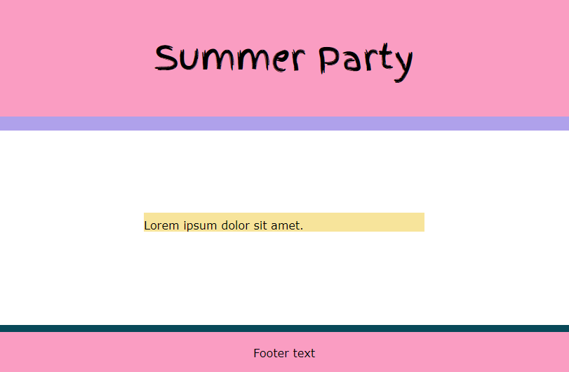

## Design your mood board

In this step you will choose a topic for your mood board and choose a matching colour palette and fonts. You will check that your colour palette has good contrast so that it is accessible. 

Image, gif or video showing what they will achieve by the end of the step. {:width="300px"}

--- task ---

What is the topic of your mood board? 

+ **Party**: for a specific occasion or theme
+ **Artwork**: Book cover, poster, flyer, comic book
+ **Logo** or **product** design 
+ **Decorate a space**: Classroom, makerspace, cafe
+ **Fashion design**: glasses frames, sari, bag
+ **Inspired by nature**: Terrarium, outside space
+ **Inspired by animals**: Fish tank, tropical rainforest 
+ **Character** design or world **building**

Remember, you don't need to create a complete web page, you are just going to make a page that is visually appealing and sets a mood.

--- /task ---

--- task ---

Open the [mood board starter project](https://trinket.io/html/bb2ee12497){:target="_blank"}

--- /task ---

--- task ---

Change the `<title>` element text to the title of your page. For example 'Summer party'.

--- /task ---

--- task ---

Change the `<h1>` heading of your mood board to match your topic. You can use the same text that you used for your `<title>`.

--- /task ---

**Graphic designers, interior designers, industrial designers, photographers, user interface designers and other creative artists** use mood boards to visually illustrate the style they wish to pursue. Amateur and professional designers alike may use them as an aid for more subjective purposes such as how they want to decorate their bedroom, or the vibe they want to convey through their fashion.

The 'style.css' file in the starter project includes a colour palette with:
+ constrasting `page` and `onpage` colours which are used for the background of your page,
+ `primary`, `secondary` and `tertiary` colours with matching `onprimary`, `onsecondary` and `ontertiary` colours - these can be used whenever you want different coloured `<section>` or `
` elements,
+ `detail1` and `detail2` colours which can be used to add coloured highlights.  

The `page` colour scheme is used outside of the `<main>` content. 
The `primary` colour scheme is used for content inside `<main>` unless you use a different class. 

--- task ---

**Choose:** Set the colour palette for your mood board. You will need 5 colours `primary`, `secondary`, `tertiary`, `detail` and `detail2`.

You could use one of the 20 included colour palettes or create your own:

[[[hex-colour-palettes]]]

[[[web-colour-palette]]]

Or, you could choose an image and then select a colour palette to match:

[[[trinket-image-library]]]
[[[colours-from-image]]]

You might want to create additional colour variables to use in your project:

[[[add-colour-variables]]]

**Note** that `page` is typically kept white `#ffffff` but you might decide to change it as well. 

--- /task ---

--- task ---

**Choose:** Your colour palette needs some contrasting colours to pair with `primary`, `secondary` and `tertiary`. Constrasting colours make the text readable for your user. You can check and adjust your colours using a [contrast checker](https://webaim.org/resources/contrastchecker/){:target="_blank"}.

[[[contrast-checker]]]

**Tip:** If you are finding it difficult to find contrasting colours, black works well on light backgrounds and white works well on dark backgrounds. 

**Tip:** that if you have used one of our themes then you will already have suitable contrasting colours. 

--- /task ---

--- task ---

**Test:** Check that your web page is using your new colour palette. 

--- /task ---

--- task ---

**Choose:** Select fonts that work well to set the style of your mood board. 

**Tip:** If you are using one of the css colour palette files included in the starter project matching font variables have been set up for you. You can change the fonts used in these variable if you want to use a different style.   

[[[included-fonts]]]
[[[web-fonts]]]
[[[google-fonts]]]

--- /task ---

--- task ---

**Test:** Check that your web page is using your new fonts. 

--- /task ---

--- task ---

Now that you have decided the theme for your mood board web page, and created your colours and fonts, it is a good idea to save your project. 

If you have a Trinket account, you can click on the **Remix** button to save a copy to your **My Trinkets** library.

If you don’t have a Trinket account, you can still come back to your project in the future on the same computer by using the starter project link.

You can also publish your saved mood board to see what it would look like as a full web page. Each time you save your project your published site will update: 

[[[trinket-publish-project]]]

**Tip:** To make your mood board viewable by people with disabilities and appealing to a wide audience you need to make sure it is accessible: 

[[[check-accessibility]]]

--- /task ---
