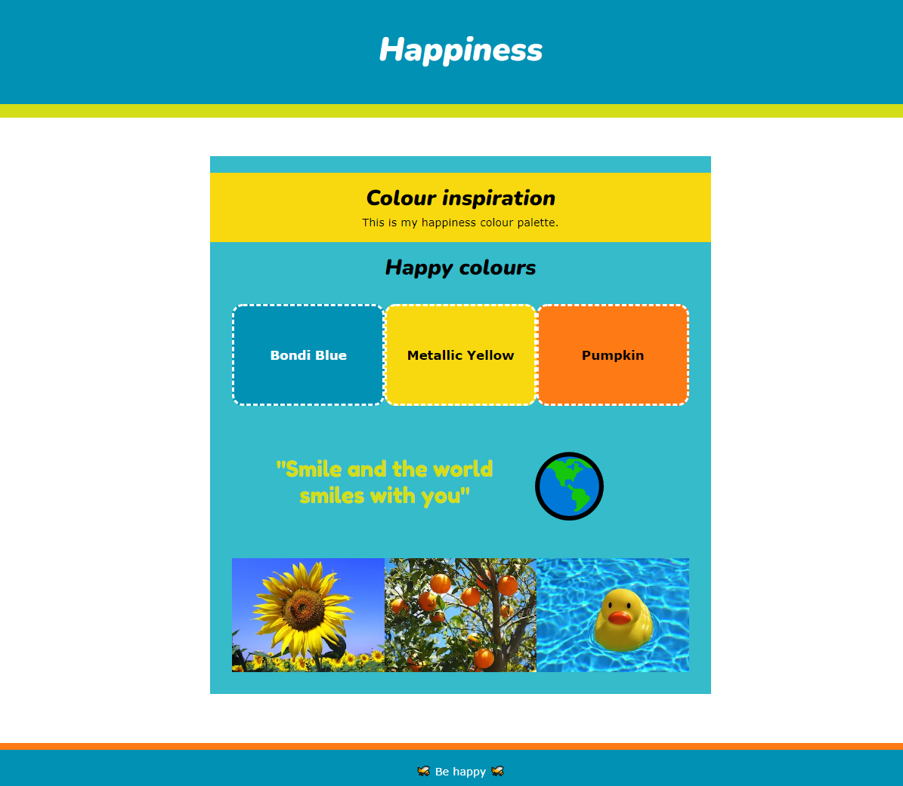

## Add style

In this step you can add style to your mood board including font sizes and styles, centering, borders, gradients, transparency or rounded corners. You don't need to add everything! Just add the features that you need to create the effect you want. 

{:width="300px"}

--- task ---

Use the `primary`, `secondary` and `tertiary` classes to control the colours of each `<section>` or `
`.

**Tip:** You don't have to have text in every box, you can just create a solid block of colour. 

[[[web-primary-secondary]]]

--- /task ---

--- task ---

You can change the size, centering and font weight and style of text on your mood board:

[[[web-large-text-tiles]]]

[[[web-center-text]]]

[[[web-strong-em]]]

--- /task ---

--- task ---

You can add rounded corners, borders, gradients or transparency to style your `<section>` or `
` elements. 

[[[rounded-corners]]]

[[[web-borders]]]

[[[add-a-gradient]]]

--- /task ---

--- task ---

You might want to create additional colour variables to use in your project:

[[[add-colour-variables]]]

--- /task ---

--- task ---

**Test:** Check that you are happy with the way your mood board looks. Don't feel that you have to use lots of different effects, sometimes less is more! 

--- /task ---