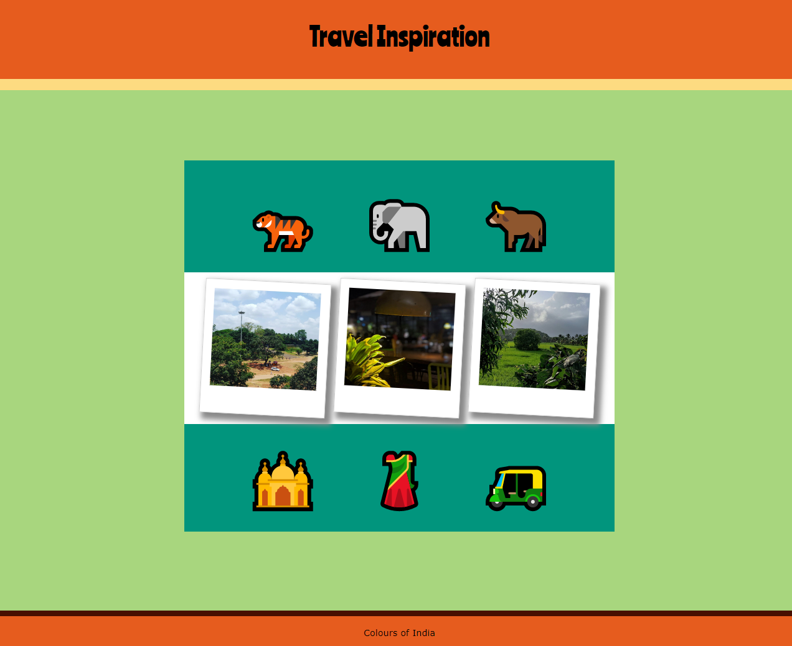
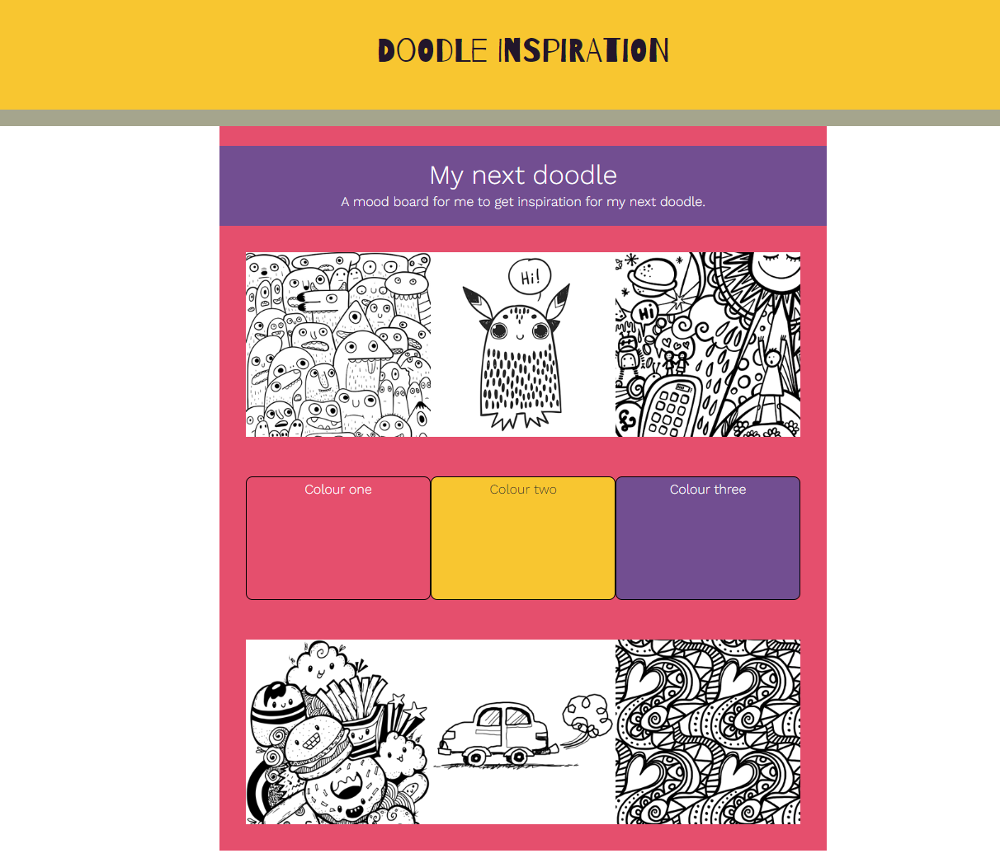

## Introduction

Dans ce projet, tu créeras une page web de tableau d'humeur pour un projet réel ou imaginaire. Tu peux faire un tableau d'humeur pour réaménager ta chambre à coucher ou pour représenter un article de mode, une fête ou un site Internet. Ton tableau d'humeur peut aussi être un rappel de toutes les choses qui te rendent heureux.

Un **tableau d'humeur** est un collage dans lequel des images, des polices, des couleurs et d'autres éléments de conception sont disposés pour créer un look ou un style pour un projet. Les tableaux d'humeur peuvent être utilisés pour créer des marques, des conceptions de produits et de nombreux autres types de projets de conception.

Tu vas :

- Avoir plusieurs sections avec des mises en page différentes dans ta page web
- Utiliser différentes couleurs et polices qui fonctionnent bien ensemble
- Utiliser des images, des emojis ou les deux

--- no-print ---

--- task --- 

### Essaie-le

  
Une façon de se sentir plus heureux est de se rappeler ce qui est important pour toi. Tu pourrais dresser une liste des choses qui te rendent heureux, puis créer un tableau d'humeur pour les afficher ensemble.

**Bonheur** : [Voir à l'intérieur](https://editor.raspberrypi.org/fr-FR/projects/happiness-mood-board){:target="_blank"}

<iframe src="https://editor.raspberrypi.org/fr-FR/embed/viewer/happiness-mood-board" width="600" height="500" frameborder="0" marginwidth="0" marginheight="0" allowfullscreen> </iframe>

--- /task ---

### Trouve l'inspiration

Tu vas prendre des décisions de conception pour créer ton tableau d'humeur.

--- task ---

Explore ces exemples de projets pour obtenir plus d'idées :

**Scarabée** : [Voir à l'intérieur](https://editor.raspberrypi.org/fr-FR/projects/beetle-mood-board){:target="_blank"}

<iframe src="https://editor.raspberrypi.org/fr-FR/embed/viewer/beetle-mood-board" width="600" height="500" frameborder="0" marginwidth="0" marginheight="0" allowfullscreen> </iframe>

**Couleurs de l'Inde** : [Voir à l'intérieur](https://editor.raspberrypi.org/fr-FR/projects/travel-mood-board){:target="_blank"}

<iframe src="https://editor.raspberrypi.org/fr-FR/embed/viewer/travel-mood-board" width="600" height="500" frameborder="0" marginwidth="0" marginheight="0" allowfullscreen> </iframe>

**Doodles** : [Voir à l'intérieur](https://editor.raspberrypi.org/fr-FR/projects/doodle-mood-board){:target="_blank"}

<iframe src="https://editor.raspberrypi.org/fr-FR/embed/viewer/doodle-mood-board" width="600" height="500" frameborder="0" marginwidth="0" marginheight="0" allowfullscreen> </iframe>

--- /task ---
--- /no-print ---

--- print-only ---

### Trouve l'inspiration

**Bonheur**

**Couleurs de l'Inde**

**Scarabée**

**Doodles**

--- /print-only ---
