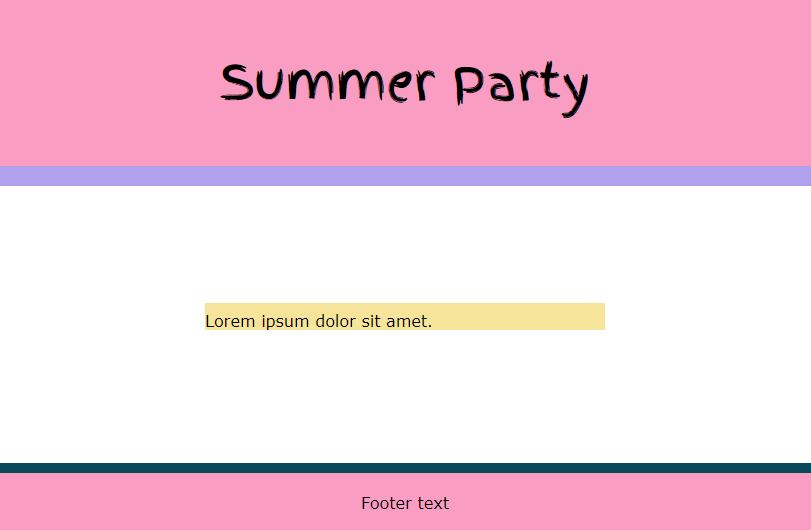
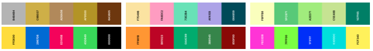
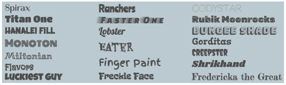

## Concevoir ton tableau d'humeur

Dans cette étape, tu décideras d'un sujet pour ton tableau d'humeur et tu choisiras une palette de couleurs et des polices de caractères assorties. Tu devras également vérifier que ta palette présente un bon contraste de couleurs afin qu'elle soit accessible. 

{:width="300px"}

--- task ---

Quel est le sujet de ton tableau d'humeur ?

- 🎉 **Fête** : pour une occasion ou un thème spécifique
- 🎨 **Oeuvre** : couverture de livre, affiche, flyer, bande dessinée
- 🥤 Conception de **Logo** ou **produit**
- 🛏️ **Décorer un espace** : salle de classe, maker space, café
- 🥻 **Design de mode** : montures de lunettes, sari, sac
- 🌳 **Inspiré de la nature** : terrarium, espace extérieur
- 🐠 **Inspiré des animaux** : aquarium, forêt tropicale humide
- 🤖 **Conception de personnages** ou **construction de monde**

Pour ce projet, tu dois réaliser une page web qui soit visuellement attrayante et qui mette de l'ambiance.

--- /task ---

Ta page web ne doit pas contenir d'informations **personnelles** pouvant révéler ton identité et/ou ta localisation. Fais très attention aux personnes avec lesquelles tu partages tes informations personnelles.  

--- task ---

Ouvrir le [projet de démarrage tableau d'humeur](https://editor.raspberrypi.org/fr-FR/projects/mood-board-starter){:target="_blank"}.

--- /task ---

--- task ---

Remplace le texte de l'élément `<title>` par le titre de ta page. Par exemple « Fête d'été ».

--- /task ---

--- task ---

Modifie le titre `<h1>` de ton tableau d'humeur pour qu'il corresponde à ton sujet. Tu peux utiliser le même texte que celui que tu as utilisé pour ton `<title>`.

--- /task ---

**Les graphistes, les architectes d'intérieur, les designers industriels, les photographes, les concepteurs d'interface utilisateur et d'autres artistes créatifs** utilisent des tableaux d'humeur pour illustrer visuellement le style qu'ils souhaitent poursuivre. Les designers amateurs et professionnels peuvent utiliser les tableaux d'humeur comme une aide à des fins plus subjectives, comme la façon dont ils veulent décorer leur chambre à coucher.

Ton tableau d'humeur utilisera une palette de couleurs pour qu'il soit attrayant avec des couleurs qui fonctionnent bien ensemble.

[[[web-colour-palette-variables]]]

--- task ---

**Choisir :** définis la palette de couleurs de ton tableau d'humeur.

Choisis l'une des 20 palettes de couleurs incluses.

[[[hex-colour-palettes]]]

--- /task ---

--- task ---

**Test :** vérifie que ta page web utilise ta nouvelle palette de couleurs.

--- /task ---

--- task ---

Le projet de départ comporte des variables de police correspondantes qui ont été configurées pour toi. Tu peux changer les polices utilisées dans ces variables si tu veux utiliser un style différent.

[[[included-fonts]]]
[[[web-fonts]]]
[[[google-fonts]]]

--- /task ---

--- task ---

**Test :** vérifie que ta page web utilise tes nouvelles polices, si tu les as ajoutées.

--- /task ---

--- task ---

Maintenant que tu as décidé du thème de la page web de ton tableau d'humeur, et que tu as créé tes couleurs et tes polices, il est conseillé d'enregistrer ton projet.

--- /task ---
