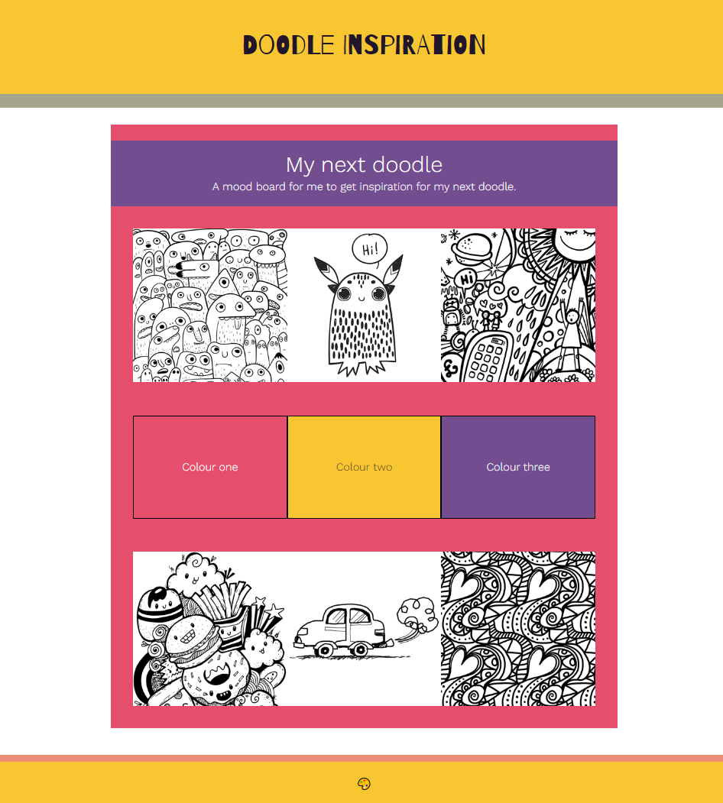

## Ajouter ton contenu

Dans cette étape, tu rempliras ta mise en page avec du contenu pour créer l'ambiance que tu souhaites.

{:width="300px"}

--- task ---

{:width="300px"}

Ajoute n'importe quel **texte** que tu souhaites voir apparaître sur ton tableau d'humeur.

**Choisir :** ton texte peut être une combinaison de :

- Mots ou de phrases courtes qui correspondent à ton sujet
- Texte d'espace réservé absurde (« lorem ipsum ») pour donner une idée de ce à quoi ressemblerait le texte
- Citations inspirantes

Ne passe pas trop de temps sur les détails du texte. Un tableau d'humeur permet simplement de donner le ton à ton projet.

[[[add-placeholder-text]]]

[[[full-width-quote]]]

--- /task ---

--- task ---

**Choisir :** ajoute des images et/ou des emojis pour rendre ta page web intéressante.

Le projet de démarrage comprend de nombreuses images que tu pourras utiliser sur ton tableau d'humeur.

[[[rpfeditor-image-library]]]

[[[huge-emoji]]]

Il existe un grand nombre d'emojis différents.

[[[choose-an-emoji]]]

**Astuce :** tu peux très bien utiliser la même image ou le même emoji plusieurs fois sur ta page web pour remplir rapidement ta page.

--- /task ---

--- task ---

**Débogage :**

--- collapse ---
---
title: Mon contenu a des hauteurs différentes et le résultat est étrange
---

Lorsque tu ajoutes du contenu de différentes hauteurs, les boîtes qui l'entourent auront également des hauteurs différentes.

Tu peux changer cela en ajoutant la classe `tile` :

--- code ---
---
language: HTML
filename: index.html
line_numbers: false
 
---

--- /code ---

`tile` définit une hauteur spécifique pour chacun des éléments qui ont cette classe. Pour ajuster la hauteur, modifie-la dans le fichier `style.css`.

--- code ---
---
language: CSS
filename: style.css
line_numbers: false
 
---
.tile {
  height: 9.4rem;
}
--- /code ---

Ajoute la classe `tile` pour que chaque élément de cette classe ait la même hauteur.

--- /collapse ---

--- /task ---

--- task ---

**Test :** jette un œil à ta page web. Assure-toi que tu es satisfait du contenu de ta page.

[[[image-not-displayed]]]

--- /task ---
