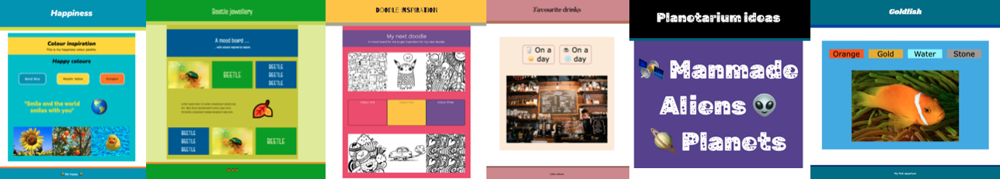
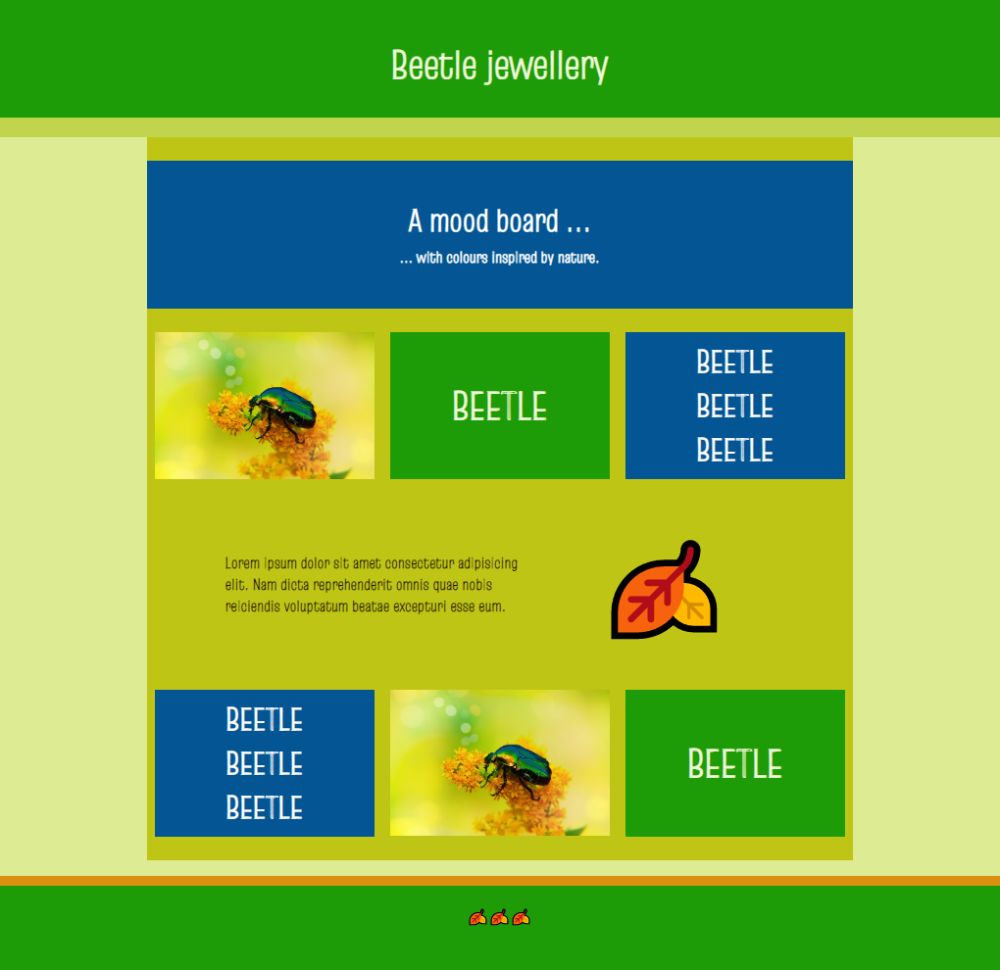

## Inleiding

In dit project maak je een moodboard-webpagina voor een echt of denkbeeldig project. Je kunt een moodboard maken om je slaapkamer opnieuw in te richten of om een mode-item, feest of website weer te geven. Als alternatief kan je moodboard een herinnering zijn aan alle dingen die je gelukkig maken.

Een **moodboard** is een collage waarin afbeeldingen, lettertypen, kleuren en andere ontwerpelementen worden gerangschikt om een uiterlijk of stijl voor een project te creëren. Moodboards kunnen gebruikt worden om merken, productontwerpen en vele andere soorten ontwerpprojecten te maken.

Je gaat:

- Meerdere secties met verschillende lay-outs in je webpagina hebben
- Verschillende kleuren en lettertypen gebruiken die goed bij elkaar passen
- Afbeeldingen, emoji's of beiden gebruiken

\--- no-print ---

\--- task ---

### Probeer het uit

  
Eén manier om je gelukkiger te voelen, is door te onthouden wat belangrijk voor je is. Je kunt een lijst maken van dingen waar je blij van wordt en vervolgens een moodboard maken om ze samen weer te geven.

**Geluk**: [Bekijk van binnen](https://editor.raspberrypi.org/en/projects/happiness-mood-board){:target="_blank"}

<iframe src="https://editor.raspberrypi.org/en/embed/viewer/happiness-mood-board" width="600" height="500" frameborder="0" marginwidth="0" marginheight="0" allowfullscreen> </iframe>

\--- /task ---

### Doe inspiratie op

Je gaat een aantal ontwerpbeslissingen nemen om je moodboard te maken.

\--- task ---

Bekijk deze voorbeeldprojecten om meer ideeën op te doen:

**Kever**: [Bekijk van binnen](https://editor.raspberrypi.org/en/projects/beetle-mood-board){:target="_blank"}

<iframe src="https://editor.raspberrypi.org/en/embed/viewer/beetle-mood-board" width="600" height="500" frameborder="0" marginwidth="0" marginheight="0" allowfullscreen> </iframe>

**Kleuren van India**: [Bekijk van binnen](https://editor.raspberrypi.org/en/projects/travel-mood-board){:target="_blank"}

<iframe src="https://editor.raspberrypi.org/en/embed/viewer/travel-mood-board" width="600" height="500" frameborder="0" marginwidth="0" marginheight="0" allowfullscreen> </iframe>

**Doodles**: [Bekijk van binnen](https://editor.raspberrypi.org/en/projects/doodle-mood-board){:target="_blank"}

<iframe src="https://editor.raspberrypi.org/en/embed/viewer/doodle-mood-board" width="600" height="500" frameborder="0" marginwidth="0" marginheight="0" allowfullscreen> </iframe>

\--- /task ---
\--- /no-print ---

\--- print-only ---

### Doe inspiratie op

**Geluk**

**Kleuren van India**

**Kever**

**Doodles**

\--- /print-only ---
