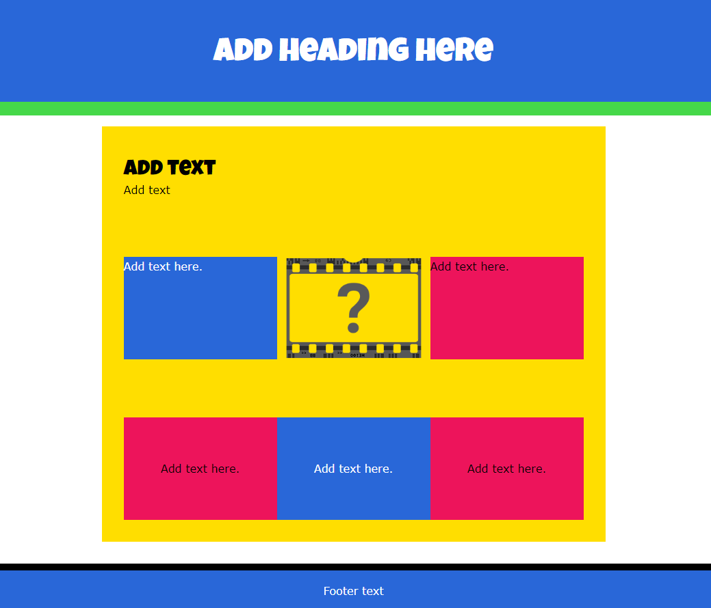

## Kies een lay-out voor je moodboard

In deze stap ontwerp je de hele lay-out van jouw moodboard en voeg je inhoudssecties toe met tijdelijke inhoud. 

{:width="300px"}

--- task ---

Je maakt verschillende inhoudssecties voor je moodboard en kunt een combinatie van tekst, afbeeldingen of emoji's gebruiken.

Denk na over de secties die je wilt toevoegen. Als je wilt, kun je je lay-out op papier schetsen.

--- /task ---

--- task ---

Voeg minimaal drie secties toe aan `<main></main>` in je moodboard. Je kunt er meer toevoegen als je wilt.

[[[full-width-section]]]

[[[side-by-side-section]]]

[[[wrapped-regular-width]]]

[[[three-text-tiles]]]

[[[text-image-text]]]

[[[wrapped-wide-narrow]]]

[[[full-width-quote]]]

[[[web-wrap-gap]]]

--- /task ---

--- task ---

**Test:** Controleer of je tevreden bent met de lay-out van de pagina. Maak je nog geen zorgen over de werkelijke inhoud of afbeeldingen. Die ga je pas in de volgende stap toevoegen.

**Mijn webpagina wordt niet correct weergegeven**

[[[incorrect-tags]]]

[[[mismatched-tags]]]

--- /task ---
