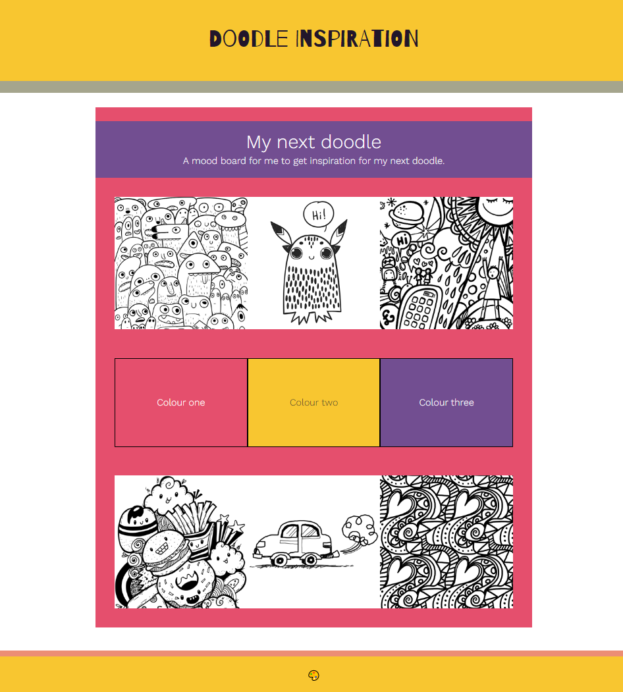
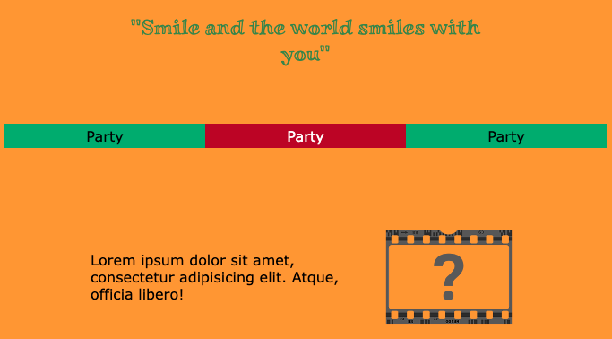

## Voeg je inhoud toe

In deze stap vul je jouw lay-out in met inhoud om de gewenste sfeer te creëren. 

{:width="300px"}

--- task ---

{:width="300px"}

Voeg alle **tekst** toe die je wilt zien op je moodboard.

**Kies:** Je tekst kan elke combinatie zijn van:

- Korte woorden of zinnen die bij je onderwerp passen
- Onzintekst ('lorem ipsum') om een idee te geven van hoe de tekst eruit zou zien
- Een inspirerend citaat

Besteed niet te veel tijd aan de tekstdetails. Een moodboard bepaalt gewoon de sfeer van jouw project.

[[[add-placeholder-text]]]

[[[full-width-quote]]]

--- /task ---

--- task ---

**Kies:** Voeg afbeeldingen en/of emojis toe om je webpagina er interessant uit te laten zien.

Het startproject bevat veel afbeeldingen die je op je moodboard kunt gebruiken.

[[[rpfeditor-image-library]]]

[[[huge-emoji]]]

Er zijn veel verschillende emoji's om uit te kiezen.

[[[choose-an-emoji]]]

**Tip:** Het is prima om meerdere keren dezelfde afbeelding of emoji op je webpagina te gebruiken om snel je pagina te vullen.

--- /task ---

--- task ---

**Fouten oplossen:**

--- collapse ---
---
title: Mijn inhoud heeft verschillende hoogtes en ziet er vreemd uit
---

Wanneer je inhoud met verschillende hoogtes toevoegt, hebben de vakken eromheen ook verschillende hoogtes.

Je kunt dit veranderen door de klasse `tile` toe te voegen:

--- code ---
---
language: HTML
filename: index.html
line_numbers: false
 
---

--- /code ---

`tile` stelt een specifieke hoogte in voor elk van de elementen die deze klasse hebben. Om de hoogte aan te passen, verander je deze in het `style.css` bestand.

--- code ---
---
language: CSS
filename: style.css
line_numbers: false
 
---
.tile {
  height: 9.4rem;
}
--- /code ---

Voeg de klasse `tile` toe om elk element met die klasse dezelfde hoogte te geven.

--- /collapse ---

--- /task ---

--- task ---

**Test:** Bekijk jouw webpagina. Zorg ervoor dat je tevreden bent met de inhoud op je pagina.

[[[image-not-displayed]]]

--- /task ---
