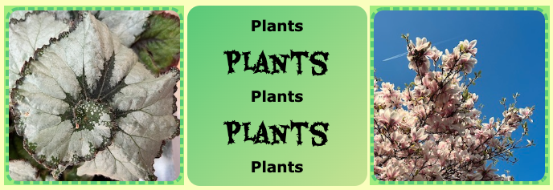

## Voeg stijl toe

In deze stap kun je jouw moodboard opmaken met lettergroottes en -stijlen, centrering, randen, verlopen, transparantie of afgeronde hoeken. Je hoeft niet alles toe te voegen! Voeg gewoon de functies toe die je nodig hebt om het gewenste effect te creëren. 

{:width="300px"}

--- task ---

Gebruik de klassen `primary`, `secundary` en `tertiary` om de kleuren van elke `<section>` of `
` te bepalen.

**Tip:** Je hoeft geen tekst in elk vak te hebben. Je kunt ook gewoon een egaal kleurblok maken.

[[[web-primary-secondary]]]

--- /task ---

--- task ---

Je kunt de grootte, centrering, lettergrootte en stijl van de tekst op jouw moodboard wijzigen.

[[[web-large-text-tiles]]]

[[[web-center-text]]]

[[[web-strong-em]]]

--- /task ---

--- task ---

Je kunt afgeronde hoeken, schaduwen, grenzen, kleurverlopen en transparantie toevoegen om je `<section>` of `
` elementen op te maken.

[[[rounded-corners]]]

[[[web-borders]]]

[[[add-a-gradient]]]

[[[web-box-shadow]]]

--- /task ---

--- task ---

Misschien wil je extra kleurenvariabelen maken in jouw project.

[[[add-colour-variables]]]

--- /task ---

--- task ---

Je kunt eventueel ook je eigen klasse toevoegen. Dit voorbeeld voegt een klasse toe voor een foto-effect.

[[[web-add-class]]]

--- /task ---

--- task ---

**Test:** Controleer of je tevreden bent met de manier waarop je moodboard eruit ziet. Je hoeft zeker niet alle effecten te gebruiken. Onthoud &mdash; soms is hoe simpeler hoe beter!

--- /task ---
